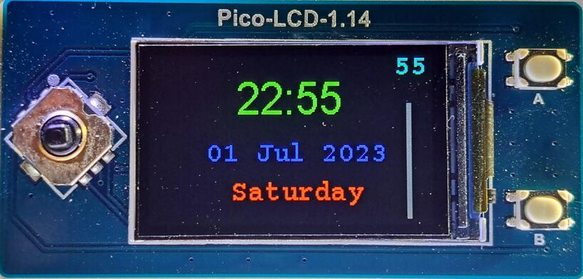
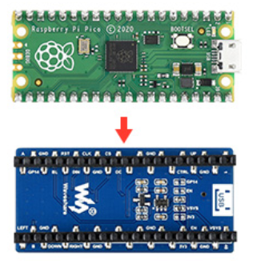
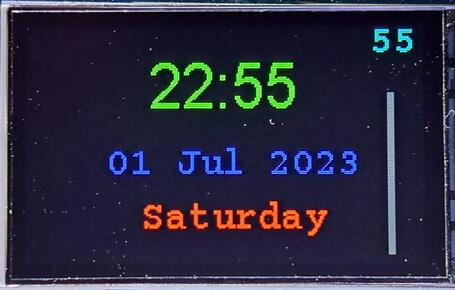

# PicoClock

Simple MicroPython based digital clock. Motivation of this project is to explore methods to implement displays for MicroPython based microcontrollers. This application relies on [`micropython-nano-gui`](https://github.com/peterhinch/micropython-nano-gui "https://github.com/peterhinch/micropython-nano-gui"), provided by [peterhinch](https://github.com/peterhinch "https://github.com/peterhinch"), which provides all necessary display drivers, fonts and widgets. This greatly simplifies creation of applications requiring physical displays. The code can be easily tweaked to work with a variety of microcontroller boards and displays.



## Microcontroller

This application was developed on [Raspberry Pi Pico W](https://www.raspberrypi.com/products/raspberry-pi-pico/ "https://www.raspberrypi.com/products/raspberry-pi-pico/") but as mentioned earlier almost any MicroPython based microcontroller could be used. Boards supporting WiFi make the final product much more flexible as a full PC will not be required to provide time synchronization. Initial development uses MicroPython v1.20.0 (2023-04-26).

## Display

The display chosen for this application is [Waveshare Pico-LCD-1.14](https://www.waveshare.com/pico-lcd-1.14.htm "https://www.waveshare.com/pico-lcd-1.14.htm"). This display contains headers which can directly connect to a Raspberry Pi Pico, greatly simplifying time and effort required for completing the project. No special circuit boards, connectors, wires or enclosure required! Also, this display contains two extra buttons and a joystick which will be useful for many future projects. The resolution is 240x135 pixels, screen is IPS LCD and uses a ST7789VW interface IC.



## mpremote Installation

Although there are several methods to interact with a microcontroller such as Raspberry Pi Pico, this guide will focus on command line methods as they are simplest and more universally available on various OS platforms. The `mpremote` command line tool is a preferred method to interact with a MicroPython device over a serial bus. However, if one wants or needs a more graphical method to interact with the device, the author recommends [Thonny](https://thonny.org/ "https://thonny.org/") integrated development environment (IDE) as it is optimized for Python/MicroPython. Installation and usage of Thonny is outside the scope of this project. Modification of the `PATH` environment variable may be needed if `pip` installs to ~/.local/bin which is the case for many Linux distributions.
```
$ echo 'PATH=$PATH:~/.local/bin' >> .bashrc
$ source ~/.bashrc
$ pip install mpremote
$ mpremote connect list                    # this will show devices on usb
$ mpremote connect                         # make test connection to verify 
Connected to MicroPython at /dev/ttyACM0
Use Ctrl-] or Ctrl-x to exit this shell    # press Ctrl-x to exit shell
$
```

## MicroPython Installation

This guide assumes you are using a Raspberry Pi Pico W. Host computer OS is assumed to be Linux so some of the commands may be slightly different depending on the flavor of OS and your specific environment details. Connect Raspberry Pi Pico W to USB port on your computer. Download MicroPython and flash firmware to the device.
```
$ cd ~
$ wget https://micropython.org/download/rp2-pico-w/rp2-pico-w-latest.uf2
$ mpremote bootloader
$ cp rp2-pico-w-latest.uf2 /media/<username>/RPI-RP2
```

## Clone Repositories

Clone `PicoClock` and `micropython-nano-gui` project repositories into the current user home directory. The `micropython-nano-gui` project contains all necessary display drivers, fonts and widgets.
```
$ cd ~
$ git clone https://github.com/efranzwa/PicoClock.git
$ git clone https://github.com/peterhinch/micropython-nano-gui.git
```

## WiFi Configuration (optional)

Copy `config.py` to the device. Edit `config.py` with your favorite editor. My favorite is `vi` and should also be yours :sunglasses:.  Modify the "my-wifi-ssid" and "my-wifi-password" with your wifi credentials, keep the quotes. Keep in mind that the Raspberry Pi Pico W only works on 2.4G WiFi channels so make sure your access point has this enabled. 
```
$ cd ~/PicoClock/src
$ echo $EDITOR             # check to see that text editor is defined
/usr/bin/vi                # this host uses vi
$ mpremote cp config.py :
cp config.py :
$ mpremote edit config.py  # editor will open
edit config.py
```

## WiFi Verification (optional)

Use the `wlanc.py` script to verify the device can make a successful WiFi connection. First run `wlanc.py` script from the host to verify. Copy the `boot.py` script to the device and perform a reset. This will check to see if the device can automatically connect to WiFi after applying power. Recall that `boot.py` will run first automatically after power is applied or if device is reset.
```
$ mpremote run wlanc.py
starting wifi
waiting for connection....connected
ip = 192.168.3.130
$ mpremote cp boot.py :
cp boot.py :
$ mpremote reset
```

## Setup GUI Files

The [`micropython-nano-gui`](https://github.com/peterhinch/micropython-nano-gui "https://github.com/peterhinch/micropython-nano-gui") repository contains the required GUI files. Please refer to its [README](https://github.com/peterhinch/micropython-nano-gui/blob/master/README.md#211-core-files "https://github.com/peterhinch/micropython-nano-gui/blob/master/README.md#211-core-files") for detailed explanation of how the GUI library works. Below is a typical workflow for setting up and copying the required files.

Copy required display setup file from `setup_examples` to `color_setup.py`. Create a copy on the device.
```
$ cd ~/micropython-nano-gui
$ cp setup_examples/st7789_pico_lcd_114.py color_setup.py # for Pico-LCD-1.14 display
$ mpremote cp color_setup.py :
```

Copy drivers, fonts, widgets to device.
```
$ cd ~/micropython-nano-gui
$ mpremote cp -r drivers : 
cp -r drivers :
$ mpremote cp -r gui :
cp -r gui :
$ mpremote cp color_setup.py :
cp color_setup.py :
```

## Setup PicoClock Application

Copy `pclock.py` to device. If renamed `main.py` then the application will run automatically after power up. If manual start is desired then just copy `pclock.py` to device without renaming. Reset device to start `PicoClock`.
```
$ cd ~/PicoClock
$ mpremote cp src/pclock.py :main.py
cp src/pclock.py :main.py
$ mpremote cp src/pclock.py :  # optional for manual start
cp src/pclock.py :             # optional for manual start
$ mpremote reset
```

## PicoClock Display



Note that the initial version of PicoClock displays time in Greenwich Mean Time (GMT). Future versions will include options to set time zone and daylight savings. 

### Display contents
- 24 hour format time XX:XX
- Day Month Year
- Day of Week
- Seconds in upper right corner